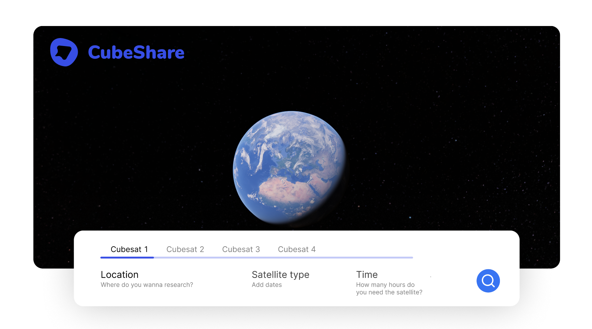
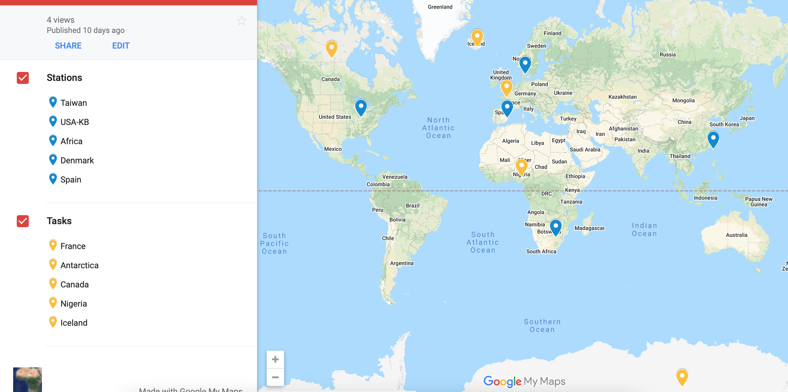

CubeSats have transformed the space industry because of the numerous benefits they provide over traditional satellites. CubeShare is a prototype for a more sustainable approach to reducing the number of deployed satellites in the lower Earth orbit. The ideas behind this project can help utilize the full potential of the already deployed satellites and make the data gathering from space more accessible for researchers all over the world.

## Booking system

## Prototype
- 3 Scenarios
- 5 Ground stations
- 5 Tasks
 

<em>Locations placement on the map</em>

 

---
## Getting Started
- *data/grStations.txt* 
  - Contains the latitude, longitude and name of each ground station
- *data/s_tasks.txt* 
  - Contains details about the bookings - longitude, latitude, task/location name, start and end date of the booking, and the amount of hours the booking is for
- *data/sats.txt* 
  - TLEs of satellites taking part in the experiment 

### Specifics :desktop_computer:  
- Prototype developed in Python 
- Python libraries needed:
  - `pyephem`
  - `matplotlib`
  - `pandas`

### Start the simulation  
Install the dependencies and run the simulation by `python3 main.py`.  
Observe the results.

 

---
> #### Project by:   
`Anders Meged` | **MSc in Digital Innovation & Management** | :email: [ameg@itu.dk](mailto:ameg@itu.dk)  
`Elitsa Marinovska` | **MSc in Computer Science** | :email: [elit@itu.dk](mailto:elit@itu.dk)  
`Louise Mortensen` | **MSc in Digital Design and Interactive Technologies** | :email: [lovm@itu.dk](mailto:lovm@itu.dk)  
`Rasmus Melberg` | **MSc in Digital Design and Interactive Technologies** | :email: [rame@itu.dk](mailto:rame@itu.dk)  
>At [IT University of Copenhagen](https://en.itu.dk)
